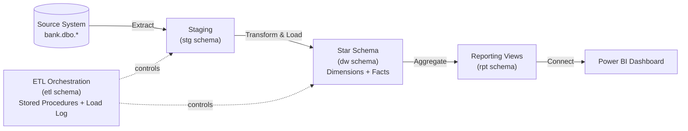
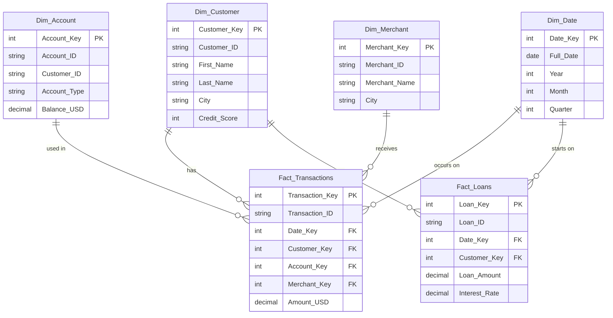

# Financial Analytics Data Warehouse

An end-to-end SQL Server data warehouse for a retail bank — built to turn raw operational data
(customers, accounts, cards, merchants, branches, loans, transactions) into analysis-ready
reporting views, orchestrated by logged, idempotent ETL stored procedures.

## Problem Statement

A retail bank's operational database is optimized for transactions, not analysis — answering
questions like *"which customers are high risk?"* or *"how did transaction volume trend this
quarter?"* means writing slow, repeated ad-hoc joins against live production tables. This project
builds a dedicated warehouse that separates operational data from analytical data, so those
questions become a single `SELECT * FROM rpt.vw_...` away.

## Architecture



**Layers:**
- **stg** — raw landing zone, truncate-and-reload copy of the source system
- **dw** — conformed Star Schema (6 dimensions, 2 facts)
- **etl** — stored procedures that orchestrate the load, with full run logging
- **rpt** — reporting views consumed directly by the BI tool

## Entity-Relationship Diagram



## Tech Stack

| Layer | Tool |
|---|---|
| Database | SQL Server (T-SQL) |
| ETL Orchestration | T-SQL stored procedures + custom load logging table |

| Version Control | Git / GitHub |

## Key Features

- **Star Schema design** — 6 dimensions, 2 fact tables, optimized for BI-tool query patterns
- **Unknown Member pattern** — every dimension has a `-1` row, so a fact row with no matching
  lookup is tagged as "Unknown" instead of silently dropped by an inner join
- **Idempotent ETL** — stored procedures check for existing natural keys before inserting, so
  re-running the pipeline never creates duplicate rows
- **Logged, orchestrated pipeline** — `etl.usp_Run_Full_ETL` runs Staging → Dimensions → Facts as
  one batch, with start/end time, row counts, and error messages recorded in `etl.Load_Log`
- **Reporting layer** — 8 views in a dedicated `rpt` schema, purpose-built for BI-tool consumption
  (KPIs, customer segmentation, risk scoring, merchant and transaction trends)
- **Data quality checks** — validation queries included to catch row-count anomalies and count how
  many facts landed on the "Unknown" member after every load

## Project Structure

```
Financial-Analytics-DWH/
├── README.md
├── sql/
│   ├── 00_Create_Database_And_Schemas.sql   -- database + stg/dw/etl/rpt schemas
│   ├── 01_Staging_Tables.sql                -- raw landing zone tables
│   ├── 02_Dimension_Tables.sql              -- Dim_* tables, Unknown members, Dim_Date calendar
│   ├── 03_Fact_Tables.sql                   -- Fact_Transactions, Fact_Loans
│   ├── 04_ETL_Stored_Procedures.sql         -- Load_Log + the 4 orchestration procedures
│   ├── 05_Views.sql                         -- rpt schema reporting views
│   ├── 06_Run_ETL_And_Validate.sql          -- runs the ETL + post-load validation queries
│   └── 07_Sample_Analysis_Queries.sql       -- ad-hoc queries against the rpt views
│── Data_Dictionary.md               -- table/column/view reference
└── insights.md                          -- key findings from the data
```

Every script is idempotent (guarded with `IF NOT EXISTS` / `IF OBJECT_ID IS NULL` / `CREATE OR ALTER`
as appropriate) — safe to re-run individually or all together without erroring on objects that
already exist.

## How to Run

1. Run the scripts in `sql/` **in numeric order**, `00` through `06`, on a SQL Server instance with
   access to the source `bank` database. `06` also runs the first ETL load and prints validation
   results.
2. To reload after source data changes: `EXEC etl.usp_Run_Full_ETL;`
3. Check the run: `SELECT * FROM etl.Load_Log ORDER BY Log_ID DESC;`
4. Use `sql/07_Sample_Analysis_Queries.sql` for ad-hoc exploration.


## Key Insights

*Key findings are documented in insights.md and are based on the validated SQL reporting layer .*

## Possible Next Steps

- Move segmentation/risk thresholds out of the view definitions into a `dw.Dim_Config` table
- Add SCD Type 2 tracking on `Dim_Customer` to preserve credit score history over time
- Schedule `etl.usp_Run_Full_ETL` as a SQL Server Agent job for automated nightly refreshes

## Author

**\<Eslam Eid\>**
[LinkedIn](#) · [GitHub](#) · [Email](#)
